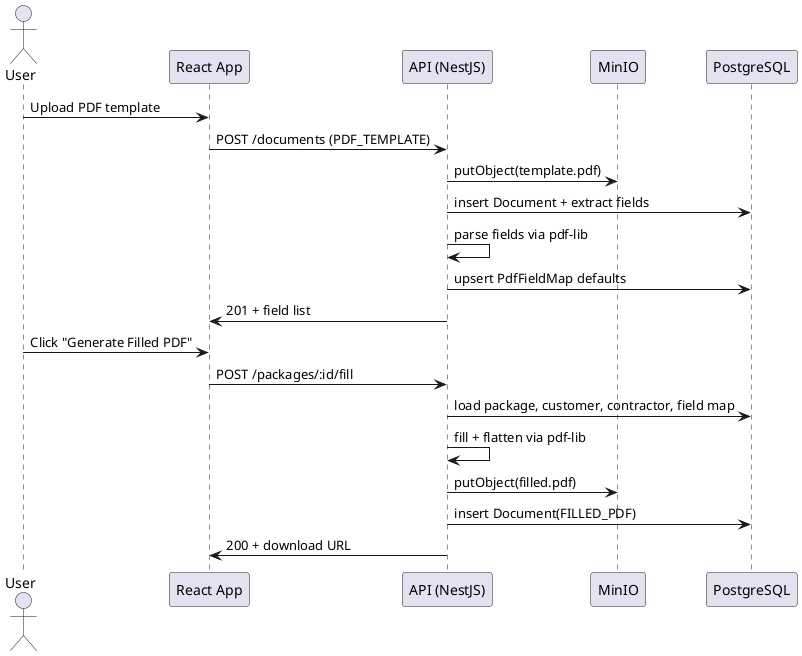

# SPEC-1-PermitPack

## Background

A self-hosted React application is needed to manage building permit packages across Florida’s 67 counties. Core needs include package lifecycle tracking, customer and contractor data, PDF template upload with form autofill, and multi-package support per customer. The system must run on Arch Linux, work on a local network, optionally be exposed to the internet with authentication, and allow county-specific checklists editable by admins. Future growth targets include notifications, dashboards, mobile-friendly UI, manual digital signing, and real-time multi-user editing.

## Requirements

### Must Have (MoSCoW: Must)

* Create, manage, and track permit package progress.
* Store detailed customer and contractor information.
* Upload PDF templates with form fields and autofill them.
* Support multiple permit packages per customer.
* Self-host on a local PC/server, LAN accessible, optional internet exposure with auth.
* Include checklists for permit packages for all 67 Florida counties; admins can add/remove items.

### Should Have (MoSCoW: Should)

* Search and filter permit packages.
* Attach documents/photos to packages.
* Support multi-user roles (Admin/User).
* Download and print filled PDFs.

### Could Have (MoSCoW: Could)

* Email notifications on status updates.
* Dashboard/calendar for deadlines.
* Mobile-friendly UI.

### Initial MVP (timeboxed)

* Manual digital signing.
* Real-time multi-user editing.
* Hooks for future workflow automation or AI features.

## Method

### Architecture Overview

* **Frontend**: React + TypeScript + Vite, TanStack Query for server state, Tailwind + shadcn/ui, PDF.js viewer for in-browser rendering, React Hook Form + Zod for forms and validation.
* **Backend**: NestJS (Fastify adapter) + Prisma ORM. REST + WebSockets for real-time edits. Class-Validator/Zod guards, RBAC via JWT.
* **Data**: PostgreSQL 15+. Full‑text search for packages/customers. Row-level security enforced via services.
* **Files**: MinIO (S3-compatible) for PDFs and attachments; presigned URLs for upload/download.
* **PDF**: pdf-lib for reading/filling/flattening AcroForms. pdf.js for viewing. Server performs final fill+flatten for integrity.
* **Realtime**: Socket rooms keyed by `packageId` for presence and edit events with last‑write‑wins plus server merge rules.
* **Deploy**: Docker Compose services: `web`, `api`, `db`, `minio`, `redis`, `caddy`. LAN-first; optional internet via Caddy with HTTPS.

### Core Domain Model (ERD)

```plantuml
@startuml
entity User { id: uuid PK
  email: text UNIQUE
  passwordHash: text
  role: enum('ADMIN','USER')
  createdAt: timestamptz
  updatedAt: timestamptz }
entity Customer { id: uuid PK
  name: text
  phone: text
  email: text
  addressId: uuid FK -> Address.id
  createdAt: timestamptz
  updatedAt: timestamptz }
entity Contractor { id: uuid PK
  companyName: text
  contactName: text
  phone: text
  email: text
  licenseNumber: text
  addressId: uuid FK -> Address.id }
entity Address { id: uuid PK
  line1: text
  line2: text
  city: text
  state: char(2)
  zip: text }
entity County { id: serial PK
  name: text UNIQUE }
entity CountyChecklistTemplateItem { id: uuid PK
  countyId: int FK -> County.id
  label: text
  category: text // e.g. Application, Site, Foundation
  permitType: enum('RESIDENTIAL','MOBILE_HOME','MODULAR_HOME')? // optional: null means applies to all
  required: boolean
  sort: int }
entity PermitPackage { id: uuid PK
  customerId: uuid FK -> Customer.id
  contractorId: uuid FK -> Contractor.id
  countyId: int FK -> County.id
  siteAddressId: uuid FK -> Address.id
  title: text
  permitType: enum('RESIDENTIAL','MOBILE_HOME','MODULAR_HOME')
  status: enum('DRAFT','IN_REVIEW','SUBMITTED','APPROVED','REJECTED','CLOSED')
  dueDate: date
  parcelNumber: text
  floodZone: text
  windExposure: text
  zoningApprovalRef: text
  createdBy: uuid FK -> User.id
  createdAt: timestamptz
  updatedAt: timestamptz }
entity MobileHomeDetails { id: uuid PK
  packageId: uuid FK -> PermitPackage.id UNIQUE
  makeModel: text
  year: int
  widthFt: int
  lengthFt: int
  serialVIN: text
  hudLabel: text
  installerLicense: text
  foundationType: text // piers, slab, stem wall
  tieDownSystem: text // e.g. engineered system name
  windZone: text }
entity PackageChecklistItem { id: uuid PK
  packageId: uuid FK -> PermitPackage.id
  label: text
  category: text
  required: boolean
  completed: boolean
  completedAt: timestamptz }
entity Document { id: uuid PK
  packageId: uuid FK -> PermitPackage.id
  type: enum('PDF_TEMPLATE','FILLED_PDF','ATTACHMENT','PHOTO')
  tag: text // e.g. site_plan, utility_letter, flood_elevation
  objectKey: text  // MinIO key
  filename: text
  mime: text
  size: int
  uploadedBy: uuid FK -> User.id
  createdAt: timestamptz }
entity PdfFieldMap { id: uuid PK
  templateDocumentId: uuid FK -> Document.id
  fieldName: text
  source: enum('CUSTOMER','CONTRACTOR','PACKAGE','MOBILE_HOME','MANUAL')
  sourcePath: text // e.g. mobileHome.hudLabel
  transform: text // optional JS expression saved as text }
entity StatusLog { id: uuid PK
  packageId: uuid FK -> PermitPackage.id
  status: text
  note: text
  createdBy: uuid FK -> User.id
  createdAt: timestamptz }
entity Signature { id: uuid PK
  packageId: uuid FK -> PermitPackage.id
  signedBy: uuid FK -> User.id
  imageObjectKey: text // PNG of signature
  createdAt: timestamptz }
User ||--o{ PermitPackage
Customer ||--o{ PermitPackage
Contractor ||--o{ PermitPackage
County ||--o{ PermitPackage
PermitPackage ||--o{ PackageChecklistItem
PermitPackage ||--o{ Document
Document ||--o{ PdfFieldMap
PermitPackage ||--|| MobileHomeDetails
PermitPackage ||--o{ StatusLog
PermitPackage ||--o{ Signature
@enduml
```

### Prisma Schema (MVP excerpt)

```prisma
// schema.prisma additions
enum PermitType { RESIDENTIAL MOBILE_HOME MODULAR_HOME }

enum Role { ADMIN USER }

model PermitPackage {
  id String @id @default(uuid())
  title String
  permitType PermitType @default(RESIDENTIAL)
  status PackageStatus @default(DRAFT)
  dueDate DateTime?
  parcelNumber String?
  floodZone String?
  windExposure String?
  zoningApprovalRef String?
  customer   Customer  @relation(fields: [customerId], references: [id])
  customerId String
  contractor Contractor @relation(fields: [contractorId], references: [id])
  contractorId String
  county     County    @relation(fields: [countyId], references: [id])
  countyId   Int
  siteAddress Address? @relation(fields: [siteAddressId], references: [id])
  siteAddressId String?
  mobileHome  MobileHomeDetails?
  createdBy  User     @relation(fields: [createdById], references: [id])
  createdById String
  checklist  PackageChecklistItem[]
  documents  Document[]
  logs       StatusLog[]
  signatures Signature[]
  createdAt  DateTime @default(now())
  updatedAt  DateTime @updatedAt
  @@index([status])
  @@index([countyId])
  @@index([permitType])
}

model MobileHomeDetails {
  id String @id @default(uuid())
  package PermitPackage @relation(fields: [packageId], references: [id])
  packageId String @unique
  makeModel String?
  year Int?
  widthFt Int?
  lengthFt Int?
  serialVIN String?
  hudLabel String?
  installerLicense String?
  foundationType String?
  tieDownSystem String?
  windZone String?
}

model CountyChecklistTemplateItem {
  id String @id @default(uuid())
  county   County   @relation(fields: [countyId], references: [id])
  countyId Int
  label String
  category String
  permitType PermitType? // null applies to all permit types
  required Boolean @default(true)
  sort Int @default(0)
}

model Document {
  id String @id @default(uuid())
  package PermitPackage @relation(fields: [packageId], references: [id])
  packageId String
  type DocType
  tag  String?
  objectKey String
  filename String
  mime String
  size Int
  uploadedBy User @relation(fields: [uploadedById], references: [id])
  uploadedById String
  createdAt DateTime @default(now())
  fieldMap PdfFieldMap[]
}

enum FieldSource { CUSTOMER CONTRACTOR PACKAGE MOBILE_HOME MANUAL }
```

```prisma
// schema.prisma
model User { id String @id @default(uuid())
  email String @unique
  passwordHash String
  role Role @default(USER)
  createdAt DateTime @default(now())
  updatedAt DateTime @updatedAt
  packages PermitPackage[] }

enum Role { ADMIN USER }

enum DocType { PDF_TEMPLATE FILLED_PDF ATTACHMENT PHOTO }

enum PackageStatus { DRAFT IN_REVIEW SUBMITTED APPROVED REJECTED CLOSED }

model Customer { id String @id @default(uuid())
  name String
  phone String? email String?
  address Address? @relation(fields: [addressId], references: [id])
  addressId String?
  packages PermitPackage[]
  createdAt DateTime @default(now())
  updatedAt DateTime @updatedAt }

model Contractor { id String @id @default(uuid())
  companyName String
  contactName String?
  phone String? email String?
  licenseNumber String?
  address Address? @relation(fields: [addressId], references: [id])
  addressId String?
  packages PermitPackage[] }

model Address { id String @id @default(uuid())
  line1 String line2 String?
  city String state String @db.Char(2) zip String }

model County { id Int @id @default(autoincrement())
  name String @unique
  templates CountyChecklistTemplateItem[] packages PermitPackage[] }

model CountyChecklistTemplateItem { id String @id @default(uuid())
  county County @relation(fields: [countyId], references: [id])
  countyId Int label String required Boolean @default(true) sort Int @default(0) }

model PermitPackage { id String @id @default(uuid())
  title String status PackageStatus @default(DRAFT)
  dueDate DateTime?
  customer Customer @relation(fields: [customerId], references: [id])
  customerId String
  contractor Contractor @relation(fields: [contractorId], references: [id])
  contractorId String
  county County @relation(fields: [countyId], references: [id])
  countyId Int
  createdBy User @relation(fields: [createdById], references: [id])
  createdById String
  checklist PackageChecklistItem[] documents Document[] logs StatusLog[] signatures Signature[]
  createdAt DateTime @default(now()) updatedAt DateTime @updatedAt }

model PackageChecklistItem { id String @id @default(uuid())
  package PermitPackage @relation(fields: [packageId], references: [id])
  packageId String label String required Boolean @default(true)
  completed Boolean @default(false) completedAt DateTime? }

model Document { id String @id @default(uuid())
  package PermitPackage @relation(fields: [packageId], references: [id])
  packageId String type DocType objectKey String filename String mime String size Int
  uploadedBy User @relation(fields: [uploadedById], references: [id])
  uploadedById String createdAt DateTime @default(now())
  fieldMap PdfFieldMap[] }

model PdfFieldMap { id String @id @default(uuid())
  template Document @relation(fields: [templateDocumentId], references: [id])
  templateDocumentId String fieldName String source FieldSource sourcePath String? transform String? }

enum FieldSource { CUSTOMER CONTRACTOR PACKAGE MANUAL }

model StatusLog { id String @id @default(uuid())
  pkg PermitPackage @relation(fields: [packageId], references: [id])
  packageId String status PackageStatus note String? createdBy User @relation(fields:[createdById], references:[id]) createdById String createdAt DateTime @default(now()) }

model Signature { id String @id @default(uuid())
  pkg PermitPackage @relation(fields: [packageId], references: [id])
  packageId String signedBy User @relation(fields:[signedById], references:[id]) signedById String imageObjectKey String createdAt DateTime @default(now()) }
```

### Key Use Cases (sequence)

#### Create + Autofill + Flatten PDF



### Search & Filter

* Postgres `to_tsvector` on `Customer.name`, `Contractor.companyName`, `PermitPackage.title`, and `StatusLog.note`. GIN index.
* Query params: `q`, `status[]`, `countyId`, `dueBefore`, `assignedTo`.

### Roles & Security

* JWT bearer tokens. Roles claim: `role` in `{'ADMIN','USER'}`.
* Admin-only: manage counties, templates, users. Users: CRUD within assigned packages.
* Presigned URLs scoped to object key and mime. PDFs are private by default.
* Audit trail via `StatusLog` and Prisma middlewares.

### Florida Counties & Checklists

* Seed `County` with all 67 names.
* Add **general** template items that fit all permits, plus a **mobile/modular home pack**. Admins can edit per county.
* On package create, clone items where `permitType IS NULL OR permitType = selectedType` into `PackageChecklistItem`.

**Default checklist categories and items (mobile/modular oriented, still general):**

```json
[
  {"category":"Application","label":"Completed permit application form","required":true},
  {"category":"Application","label":"Owner/Authorized Agent signature","required":true},
  {"category":"Site","label":"Site plan with unit footprint and setbacks","required":true},
  {"category":"Site","label":"Address verification / parcel number","required":true},
  {"category":"Zoning","label":"Zoning/land use approval or reference","required":true},
  {"category":"Flood","label":"Flood zone noted; elevation certificate if required","required":false},
  {"category":"Wind","label":"Design wind zone/exposure documented","required":true},
  {"category":"Fees","label":"Impact fees paid or deferred documentation","required":false},
  {"category":"Addressing","label":"Addressing/911 approval if required","required":false},
  {"category":"Foundation","label":"Foundation plan (piers/slab/stem wall)","required":true,"permitType":"MOBILE_HOME"},
  {"category":"Anchorage","label":"Tie-down/anchoring system details","required":true,"permitType":"MOBILE_HOME"},
  {"category":"Unit","label":"Make/Model/Year","required":true,"permitType":"MOBILE_HOME"},
  {"category":"Unit","label":"HUD label and serial/VIN","required":true,"permitType":"MOBILE_HOME"},
  {"category":"Installer","label":"Licensed installer info","required":true,"permitType":"MOBILE_HOME"},
  {"category":"Utilities","label":"Power/water/sewer letters as applicable","required":false},
  {"category":"Photos","label":"Site photos / HUD plate photo","required":false,"permitType":"MOBILE_HOME"},
  {"category":"Affidavits","label":"Installation affidavit / setup certification","required":true,"permitType":"MOBILE_HOME"}
]
```

**Document tags to standardize uploads:** `site_plan`, `foundation_plan`, `anchoring_details`, `zoning_letter`, `flood_elevation`, `utility_letter_power`, `utility_letter_water`, `utility_letter_sewer`, `hud_label_photo`, `serial_photo`, `installation_affidavit`, `impact_fee_receipt`, `addressing_approval`.

### Realtime Editing

* WebSocket namespace `/packages/:id`.

* Events: `presence`, `fieldPatch`, `checklistToggle`, `statusChanged`.

* Conflict policy: server timestamps. Reject stale versions; client retries with fresh snapshot.

* WebSocket namespace `/packages/:id`.

* Events: `presence`, `fieldPatch`, `checklistToggle`, `statusChanged`.

* Conflict policy: server timestamps. Reject stale versions; client retries with fresh snapshot.
  (MVP)

* WebSocket namespace `/packages/:id`.

* Events: `presence`, `fieldPatch`, `checklistToggle`, `statusChanged`.

* Conflict policy: server timestamps. Reject stale versions; client retries with fresh snapshot.

### Manual Digital Signing (MVP)

* Canvas-based signature pad produces PNG stored in MinIO. Link to package and user.
* Optional signature overlay on filled PDFs in server pass using pdf-lib drawImage.

### API Surface (sample)

* `POST /auth/login` -> JWT
* `GET/POST /users`
* `GET/POST /customers`, `GET/POST /contractors`
* `GET/POST /packages`, `PATCH /packages/:id/status`
* `PATCH /packages/:id` (update meta including `permitType`, `parcelNumber`, `floodZone`, `windExposure`, `zoningApprovalRef`)
* `PUT /packages/:id/mobile-home` (upsert `MobileHomeDetails`)
* `GET/POST /packages/:id/checklist`
* `POST /documents` (presigned upload), `GET /documents/:id/download`
* `POST /packages/:id/fill` -> creates FILLED\_PDF
* `GET /counties`, `POST /counties/:id/template-items`

### Non-Functional

* Target P95 API < 150ms on LAN.

* Large file handling: 50 MB per upload, streamed to MinIO.

* Backups: nightly `pg_dump` and MinIO bucket replication (optional).

* Accessibility: WCAG AA; keyboard navigable forms; PDF viewer with text layer.

* Target P95 API < 150ms on LAN.

* Large file handling: 50 MB per upload, streamed to MinIO.

* Backups: nightly `pg_dump` and MinIO bucket replication (optional).

* Accessibility: WCAG AA; keyboard navigable forms; PDF viewer with text layer.

## Implementation

### Repo layout

```
permitpack/
├─ docker-compose.yml
├─ .env.example
├─ packages/
│  ├─ api/            # NestJS v11 + Prisma v6
│  │  ├─ src/
│  │  │  ├─ main.ts
│  │  │  ├─ app.module.ts
│  │  │  ├─ auth/
│  │  │  ├─ users/
│  │  │  ├─ customers/
│  │  │  ├─ contractors/
│  │  │  ├─ counties/
│  │  │  ├─ packages/
│  │  │  ├─ documents/
│  │  │  ├─ pdf/
│  │  │  └─ gateway/
│  │  ├─ prisma/schema.prisma
│  │  ├─ prisma/seed.ts
│  │  ├─ test/e2e/*.spec.ts
│  └─ web/            # React + TS + Vite + TanStack Query v5
│     ├─ index.html
│     ├─ src/main.tsx
│     ├─ src/App.tsx
│     ├─ src/lib/api.ts
│     ├─ src/routes/*
│     ├─ src/components/*
│     ├─ src/features/{packages,customers,contractors}/*
│     └─ src/tests/*
└─ scripts/
   └─ seed-counties.ts
```

### Docker Compose (LAN-first, optional internet via Caddy)

```yaml
# docker-compose.yml
version: "3.9"
services:
  db:
    image: postgres:16-alpine
    environment:
      POSTGRES_DB: permitpack
      POSTGRES_USER: permit
      POSTGRES_PASSWORD: permit
    volumes:
      - db_data:/var/lib/postgresql/data
    healthcheck:
      test: ["CMD-SHELL", "pg_isready -U permit"]
      interval: 10s
      timeout: 5s
      retries: 5

  minio:
    image: minio/minio:latest
    command: server /data --console-address ":9001"
    environment:
      MINIO_ROOT_USER: minio
      MINIO_ROOT_PASSWORD: minio12345
    volumes:
      - minio_data:/data
    ports: ["9000:9000", "9001:9001"]

  redis:
    image: redis:7-alpine

  api:
    build: ./packages/api
    env_file: .env
    depends_on: [db, minio, redis]
    ports: ["4000:4000"]
    labels:
      caddy: ${PUBLIC_DOMAIN:-}
      caddy.reverse_proxy: "{{upstreams 4000}}"

  web:
    build: ./packages/web
    env_file: .env
    depends_on: [api]
    ports: ["5173:5173"]
    labels:
      caddy: ${PUBLIC_DOMAIN:-}
      caddy.reverse_proxy: "{{upstreams 5173}}"

  caddy:
    image: lucaslorentz/caddy-docker-proxy:2.9
    ports:
      - "80:80"
      - "443:443"
    volumes:
      - /var/run/docker.sock:/var/run/docker.sock
      - caddy_data:/data
      - caddy_config:/config
    environment:
      CADDY_INGRESS_NETWORKS: default

volumes:
  db_data: {}
  minio_data: {}
  caddy_data: {}
  caddy_config: {}
```

### Environment

```
# .env.example
NODE_ENV=production
JWT_SECRET=change_me
DATABASE_URL=postgresql://permit:permit@db:5432/permitpack?schema=public
MINIO_ENDPT=minio
MINIO_PORT=9000
MINIO_USE_SSL=false
MINIO_ACCESS_KEY=minio
MINIO_SECRET_KEY=minio12345
MINIO_BUCKET=permitpack
PUBLIC_DOMAIN=   # e.g. permits.example.com (optional). Leave empty for LAN only.
```

### Backend: NestJS bootstrap

```ts
// packages/api/src/main.ts
import { NestFactory } from '@nestjs/core';
import { AppModule } from './app.module';
import { ValidationPipe } from '@nestjs/common';
import { json } from 'body-parser';

async function bootstrap() {
  const app = await NestFactory.create(AppModule, { cors: true });
  app.useGlobalPipes(new ValidationPipe({ whitelist: true, transform: true }));
  app.use(json({ limit: '50mb' }));
  await app.listen(4000, '0.0.0.0');
}
bootstrap();
```

```ts
// packages/api/src/app.module.ts
import { Module } from '@nestjs/common';
import { PrismaModule } from './prisma/prisma.module';
import { AuthModule } from './auth/auth.module';
import { UsersModule } from './users/users.module';
import { CustomersModule } from './customers/customers.module';
import { ContractorsModule } from './contractors/contractors.module';
import { CountiesModule } from './counties/counties.module';
import { PackagesModule } from './packages/packages.module';
import { DocumentsModule } from './documents/documents.module';
import { PdfModule } from './pdf/pdf.module';
import { GatewayModule } from './gateway/gateway.module';

@Module({
  imports: [
    PrismaModule,
    AuthModule,
    UsersModule,
    CustomersModule,
    ContractorsModule,
    CountiesModule,
    PackagesModule,
    DocumentsModule,
    PdfModule,
    GatewayModule,
  ],
})
export class AppModule {}
```

### Prisma schema

```prisma
// packages/api/prisma/schema.prisma
generator client { provider = "prisma-client-js" }
datasource db { provider = "postgresql" url = env("DATABASE_URL") }

// enums omitted for brevity; identical to Method section
// models identical to Method section with @@index and FTS
model PermitPackage {
  id         String   @id @default(uuid())
  title      String
  status     PackageStatus @default(DRAFT)
  dueDate    DateTime?
  customer   Customer @relation(fields: [customerId], references: [id])
  customerId String
  contractor Contractor @relation(fields: [contractorId], references: [id])
  contractorId String
  county     County   @relation(fields: [countyId], references: [id])
  countyId   Int
  createdBy  User     @relation(fields: [createdById], references: [id])
  createdById String
  checklist  PackageChecklistItem[]
  documents  Document[]
  logs       StatusLog[]
  signatures Signature[]
  createdAt  DateTime @default(now())
  updatedAt  DateTime @updatedAt
  @@index([status])
  @@index([countyId])
}

// add materialized view for FTS via migration (see below)
```

### County seed (67 Florida counties)

```ts
// scripts/seed-counties.ts (invoked by packages/api/prisma/seed.ts)
export const FL_COUNTIES = [
  'Alachua','Baker','Bay','Bradford','Brevard','Broward','Calhoun','Charlotte','Citrus','Clay','Collier','Columbia','DeSoto','Dixie','Duval','Escambia','Flagler','Franklin','Gadsden','Gilchrist','Glades','Gulf','Hamilton','Hardee','Hendry','Hernando','Highlands','Hillsborough','Holmes','Indian River','Jackson','Jefferson','Lafayette','Lake','Lee','Leon','Levy','Liberty','Madison','Manatee','Marion','Martin','Miami-Dade','Monroe','Nassau','Okaloosa','Okeechobee','Orange','Osceola','Palm Beach','Pasco','Pinellas','Polk','Putnam','Santa Rosa','Sarasota','Seminole','St. Johns','St. Lucie','Sumter','Suwannee','Taylor','Union','Volusia','Wakulla','Walton','Washington'
];

export const DEFAULT_TEMPLATE_ITEMS = [
  { category: 'Application', label: 'Completed permit application form', required: true },
  { category: 'Application', label: 'Owner/Authorized Agent signature', required: true },
  { category: 'Site', label: 'Site plan with unit footprint and setbacks', required: true },
  { category: 'Site', label: 'Address verification / parcel number', required: true },
  { category: 'Zoning', label: 'Zoning/land use approval or reference', required: true },
  { category: 'Flood', label: 'Flood zone noted; elevation certificate if required', required: false },
  { category: 'Wind', label: 'Design wind zone/exposure documented', required: true },
  { category: 'Fees', label: 'Impact fees paid or deferred documentation', required: false },
  { category: 'Addressing', label: 'Addressing/911 approval if required', required: false },
  { category: 'Foundation', label: 'Foundation plan (piers/slab/stem wall)', required: true, permitType: 'MOBILE_HOME' },
  { category: 'Anchorage', label: 'Tie-down/anchoring system details', required: true, permitType: 'MOBILE_HOME' },
  { category: 'Unit', label: 'Make/Model/Year', required: true, permitType: 'MOBILE_HOME' },
  { category: 'Unit', label: 'HUD label and serial/VIN', required: true, permitType: 'MOBILE_HOME' },
  { category: 'Installer', label: 'Licensed installer info', required: true, permitType: 'MOBILE_HOME' },
  { category: 'Utilities', label: 'Power/water/sewer letters as applicable', required: false },
  { category: 'Photos', label: 'Site photos / HUD plate photo', required: false, permitType: 'MOBILE_HOME' },
  { category: 'Affidavits', label: 'Installation affidavit / setup certification', required: true, permitType: 'MOBILE_HOME' },
];
```

ts
// scripts/seed-counties.ts (invoked by packages/api/prisma/seed.ts)
export const FL\_COUNTIES = \[
'Alachua','Baker','Bay','Bradford','Brevard','Broward','Calhoun','Charlotte','Citrus','Clay','Collier','Columbia','DeSoto','Dixie','Duval','Escambia','Flagler','Franklin','Gadsden','Gilchrist','Glades','Gulf','Hamilton','Hardee','Hendry','Hernando','Highlands','Hillsborough','Holmes','Indian River','Jackson','Jefferson','Lafayette','Lake','Lee','Leon','Levy','Liberty','Madison','Manatee','Marion','Martin','Miami-Dade','Monroe','Nassau','Okaloosa','Okeechobee','Orange','Osceola','Palm Beach','Pasco','Pinellas','Polk','Putnam','Santa Rosa','Sarasota','Seminole','St. Johns','St. Lucie','Sumter','Suwannee','Taylor','Union','Volusia','Wakulla','Walton','Washington'
];

````

### Documents: MinIO presigned URLs
```ts
// packages/api/src/documents/minio.service.ts
import { Client } from 'minio';
import { Injectable } from '@nestjs/common';

@Injectable()
export class MinioService {
  private client = new Client({
    endPoint: process.env.MINIO_ENDPT!,
    port: Number(process.env.MINIO_PORT || 9000),
    useSSL: process.env.MINIO_USE_SSL === 'true',
    accessKey: process.env.MINIO_ACCESS_KEY!,
    secretKey: process.env.MINIO_SECRET_KEY!,
  });
  async ensureBucket(bucket: string) {
    const exists = await this.client.bucketExists(bucket).catch(() => false);
    if (!exists) await this.client.makeBucket(bucket, 'us-east-1');
  }
  presignedPut(objectName: string, bucket = process.env.MINIO_BUCKET!) {
    return this.client.presignedPutObject(bucket, objectName, 60 * 10); // 10m
  }
  presignedGet(objectName: string, bucket = process.env.MINIO_BUCKET!) {
    return this.client.presignedGetObject(bucket, objectName, 60 * 10);
  }
}
````

```ts
// packages/api/src/documents/documents.controller.ts
import { Controller, Post, Body, Get, Param } from '@nestjs/common';
import { MinioService } from './minio.service';

@Controller('documents')
export class DocumentsController {
  constructor(private readonly s3: MinioService) {}

  @Post('presign')
  async presign(@Body() dto: { key: string; op: 'put'|'get' }) {
    if (dto.op === 'put') return { url: await this.s3.presignedPut(dto.key) };
    return { url: await this.s3.presignedGet(dto.key) };
  }
}
```

### PDF fill + flatten (server)

```ts
// packages/api/src/pdf/pdf.service.ts
import { Injectable } from '@nestjs/common';
import { PDFDocument } from 'pdf-lib';

export type PdfMapping = Array<{ field: string; source: 'CUSTOMER'|'CONTRACTOR'|'PACKAGE'|'MOBILE_HOME'|'MANUAL'; path?: string; }>

@Injectable()
export class PdfService {
  async fillAndFlatten(templateBytes: Uint8Array, map: PdfMapping, context: any) {
    const pdfDoc = await PDFDocument.load(templateBytes);
    const form = pdfDoc.getForm();
    const read = (src: string, p?: string) => {
      const obj = src === 'CUSTOMER' ? context.customer : src === 'CONTRACTOR' ? context.contractor : src === 'MOBILE_HOME' ? context.mobileHome : context.package;
      return p?.split('.').reduce((a, k) => (a ? a[k] : undefined), obj);
    };
    for (const m of map) {
      const v = m.source === 'MANUAL' ? context.manual?.[m.field] : read(m.source, m.path);
      const f = form.getFieldMaybe(m.field);
      if (!f || v == null) continue;
      // @ts-ignore
      if (f.setText) f.setText(String(v));
      // @ts-ignore
      if (f.check && (v === true || v === 'true' || v === 'on')) f.check();
    }
    form.flatten();
    return await pdfDoc.save();
  }
}
```

**Mobile/Modular mapping examples:**

```json
[
  {"field":"OwnerName","source":"CUSTOMER","path":"name"},
  {"field":"SiteAddress","source":"PACKAGE","path":"siteAddress.line1"},
  {"field":"County","source":"PACKAGE","path":"county.name"},
  {"field":"MH_MakeModel","source":"MOBILE_HOME","path":"makeModel"},
  {"field":"MH_Year","source":"MOBILE_HOME","path":"year"},
  {"field":"MH_SerialVIN","source":"MOBILE_HOME","path":"serialVIN"},
  {"field":"MH_HUDLabel","source":"MOBILE_HOME","path":"hudLabel"},
  {"field":"InstallerLicense","source":"MOBILE_HOME","path":"installerLicense"}
]
```

ts
// packages/api/src/pdf/pdf.service.ts
import { Injectable } from '@nestjs/common';
import { PDFDocument } from 'pdf-lib';
import { MinioService } from '../documents/minio.service';

@Injectable()
export class PdfService {
constructor(private readonly s3: MinioService) {}
async fillAndFlatten(templateBytes: Uint8Array, data: Record\<string, string>) {
const pdfDoc = await PDFDocument.load(templateBytes);
const form = pdfDoc.getForm();
Object.entries(data).forEach((\[name, value]) => {
const field = form.getFieldMaybe(name);
if (!field) return;
// Supports Text, Checkbox, Radio, etc. Simplified for brevity
// @ts-ignore
if (field.setText) field.setText(value);
// @ts-ignore
if (field.check && (value === 'true' || value === 'on')) field.check();
});
form.flatten();
return await pdfDoc.save();
}
}

````

### Realtime gateway (presence and checklist toggles)
```ts
// packages/api/src/gateway/packages.gateway.ts
import { WebSocketGateway, WebSocketServer, SubscribeMessage, MessageBody, ConnectedSocket } from '@nestjs/websockets';
import { Server, Socket } from 'socket.io';

@WebSocketGateway({ namespace: /\/packages\/.+/, cors: { origin: '*' } })
export class PackagesGateway {
  @WebSocketServer() server!: Server;

  handleConnection(client: Socket) {
    client.join(client.nsp.name); // room per package
    this.server.to(client.nsp.name).emit('presence', { id: client.id, join: true });
  }
  handleDisconnect(client: Socket) {
    this.server.to(client.nsp.name).emit('presence', { id: client.id, join: false });
  }

  @SubscribeMessage('checklistToggle')
  onChecklistToggle(@ConnectedSocket() client: Socket, @MessageBody() body: { itemId: string; completed: boolean }) {
    this.server.to(client.nsp.name).emit('checklistPatched', body);
  }
}
````

### Frontend: Vite bootstrap

```ts
// packages/web/src/main.tsx
import React from 'react';
import ReactDOM from 'react-dom/client';
import { QueryClient, QueryClientProvider } from '@tanstack/react-query';
import App from './App';
import './index.css';
const qc = new QueryClient({ defaultOptions: { queries: { staleTime: 30_000 } } });
ReactDOM.createRoot(document.getElementById('root')!).render(
  <QueryClientProvider client={qc}>
    <App />
  </QueryClientProvider>
);
```

```tsx
// packages/web/src/features/packages/PackageForm.tsx
import { useForm } from 'react-hook-form';
import { zodResolver } from '@hookform/resolvers/zod';
import { z } from 'zod';
import { api } from '../../lib/api';

const MhSchema = z.object({
  makeModel: z.string().min(1), year: z.coerce.number().int().optional(),
  widthFt: z.coerce.number().int().optional(), lengthFt: z.coerce.number().int().optional(),
  serialVIN: z.string().optional(), hudLabel: z.string().optional(),
  installerLicense: z.string().optional(), foundationType: z.string().optional(),
  tieDownSystem: z.string().optional(), windZone: z.string().optional()
});
const PkgSchema = z.object({
  title: z.string().min(1), countyId: z.coerce.number(),
  permitType: z.enum(['RESIDENTIAL','MOBILE_HOME','MODULAR_HOME']),
  parcelNumber: z.string().optional(), floodZone: z.string().optional(), windExposure: z.string().optional(),
  zoningApprovalRef: z.string().optional(),
  siteAddress: z.object({ line1: z.string().min(1), line2: z.string().optional(), city: z.string(), state: z.string().length(2), zip: z.string() }),
  mobileHome: MhSchema.optional()
});

type FormData = z.infer<typeof PkgSchema>;

export function PackageForm({ onCreated }: { onCreated: (pkg: any) => void }) {
  const { register, watch, handleSubmit, formState: { errors } } = useForm<FormData>({ resolver: zodResolver(PkgSchema), defaultValues: { permitType: 'RESIDENTIAL', siteAddress: { state: 'FL' } } });
  const type = watch('permitType');
  const submit = async (data: FormData) => {
    const pkg = (await api.post('/packages', data)).data;
    if (data.mobileHome && type !== 'RESIDENTIAL') await api.put(`/packages/${pkg.id}/mobile-home`, data.mobileHome);
    onCreated(pkg);
  };
  return (
    <form onSubmit={handleSubmit(submit)} className="grid gap-3 max-w-3xl">
      <div className="grid grid-cols-1 md:grid-cols-2 gap-3">
        <input {...register('title')} placeholder="Title" className="border p-2 rounded"/>
        <select {...register('permitType')} className="border p-2 rounded">
          <option value="RESIDENTIAL">Residential</option>
          <option value="MOBILE_HOME">Mobile Home</option>
          <option value="MODULAR_HOME">Modular Home</option>
        </select>
        <input {...register('countyId', { valueAsNumber: true })} placeholder="County ID" className="border p-2 rounded"/>
        <input {...register('parcelNumber')} placeholder="Parcel Number" className="border p-2 rounded"/>
        <input {...register('floodZone')} placeholder="Flood Zone" className="border p-2 rounded"/>
        <input {...register('windExposure')} placeholder="Wind Exposure" className="border p-2 rounded"/>
        <input {...register('zoningApprovalRef')} placeholder="Zoning Approval Ref" className="border p-2 rounded"/>
      </div>
      <fieldset className="border rounded p-3">
        <legend className="text-sm">Site Address</legend>
        <div className="grid grid-cols-1 md:grid-cols-3 gap-3">
          <input {...register('siteAddress.line1')} placeholder="Line 1" className="border p-2 rounded"/>
          <input {...register('siteAddress.city')} placeholder="City" className="border p-2 rounded"/>
          <input {...register('siteAddress.state')} placeholder="State" className="border p-2 rounded"/>
          <input {...register('siteAddress.zip')} placeholder="ZIP" className="border p-2 rounded"/>
        </div>
      </fieldset>
      {type !== 'RESIDENTIAL' && (
        <fieldset className="border rounded p-3">
          <legend className="text-sm">Mobile/Modular Details</legend>
          <div className="grid grid-cols-1 md:grid-cols-3 gap-3">
            <input {...register('mobileHome.makeModel')} placeholder="Make/Model" className="border p-2 rounded"/>
            <input {...register('mobileHome.year')} placeholder="Year" className="border p-2 rounded"/>
            <input {...register('mobileHome.serialVIN')} placeholder="Serial/VIN" className="border p-2 rounded"/>
            <input {...register('mobileHome.hudLabel')} placeholder="HUD Label" className="border p-2 rounded"/>
            <input {...register('mobileHome.foundationType')} placeholder="Foundation Type" className="border p-2 rounded"/>
            <input {...register('mobileHome.tieDownSystem')} placeholder="Tie-down System" className="border p-2 rounded"/>
            <input {...register('mobileHome.installerLicense')} placeholder="Installer License" className="border p-2 rounded"/>
            <input {...register('mobileHome.windZone')} placeholder="Wind Zone" className="border p-2 rounded"/>
            <input {...register('mobileHome.widthFt')} placeholder="Width (ft)" className="border p-2 rounded"/>
            <input {...register('mobileHome.lengthFt')} placeholder="Length (ft)" className="border p-2 rounded"/>
          </div>
        </fieldset>
      )}
      <button className="px-3 py-2 border rounded w-fit">Create Package</button>
      {Object.keys(errors).length > 0 && <pre className="text-red-600 text-xs">{JSON.stringify(errors,null,2)}</pre>}
    </form>
  );
}
```

```tsx
// packages/web/src/features/checklists/ChecklistEditor.tsx
import { useMutation, useQuery } from '@tanstack/react-query';
import { api } from '../../lib/api';

export function ChecklistEditor({ pkgId }: { pkgId: string }) {
  const { data, refetch } = useQuery({ queryKey: ['checklist', pkgId], queryFn: async () => (await api.get(`/packages/${pkgId}/checklist`)).data });
  const toggle = useMutation({ mutationFn: async (item: any) => api.patch(`/packages/${pkgId}/checklist/${item.id}`, { completed: !item.completed }) , onSuccess: () => refetch() });
  return (
    <div>
      <h3 className="font-semibold">Checklist</h3>
      <ul className="divide-y">
        {data?.items?.map((it: any) => (
          <li key={it.id} className="py-2 flex items-center justify-between">
            <div>
              <div className="text-sm">{it.category} • {it.label}</div>
              {it.required && <span className="text-xs">Required</span>}
            </div>
            <input type="checkbox" checked={it.completed} onChange={() => toggle.mutate(it)} />
          </li>
        ))}
      </ul>
    </div>
  );
}
```

ts
// packages/web/src/main.tsx
import React from 'react';
import ReactDOM from 'react-dom/client';
import { QueryClient, QueryClientProvider } from '@tanstack/react-query';
import App from './App';
import './index.css';
const qc = new QueryClient();
ReactDOM.createRoot(document.getElementById('root')!).render( <QueryClientProvider client={qc}> <App /> </QueryClientProvider>
);

````

```ts
// packages/web/src/lib/api.ts
import axios from 'axios';
export const api = axios.create({ baseURL: import.meta.env.VITE_API_URL || '/api' });
api.interceptors.request.use((cfg) => {
  const token = localStorage.getItem('token');
  if (token) cfg.headers.Authorization = `Bearer ${token}`;
  return cfg;
});
````

```tsx
// packages/web/src/features/packages/PackageList.tsx
import { useQuery } from '@tanstack/react-query';
import { api } from '../../lib/api';

export function PackageList() {
  const { data } = useQuery({
    queryKey: ['packages'],
    queryFn: async () => (await api.get('/packages', { params: { q: '' } })).data,
  });
  return (
    <div>
      <h2 className="text-xl font-semibold">Permit Packages</h2>
      <ul>{data?.items?.map((p: any) => (
        <li key={p.id} className="border p-2 my-2 rounded">
          <div className="font-medium">{p.title}</div>
          <div className="text-sm">{p.status} • {p.county?.name}</div>
        </li>
      ))}</ul>
    </div>
  );
}
```

```tsx
// packages/web/src/features/documents/PdfUploader.tsx
import { useState } from 'react';
import { api } from '../../lib/api';

export function PdfUploader({ pkgId }: { pkgId: string }) {
  const [file, setFile] = useState<File | null>(null);
  const upload = async () => {
    if (!file) return;
    const key = `packages/${pkgId}/templates/${Date.now()}-${file.name}`;
    const { data } = await api.post('/documents/presign', { key, op: 'put' });
    await fetch(data.url, { method: 'PUT', body: file });
    alert('Uploaded');
  };
  return (
    <div className="flex gap-2">
      <input type="file" accept="application/pdf" onChange={(e) => setFile(e.target.files?.[0] || null)} />
      <button className="px-3 py-1 border rounded" onClick={upload}>Upload</button>
    </div>
  );
}
```

```tsx
// packages/web/src/features/documents/PdfViewer.tsx
import { useEffect, useRef } from 'react';
import { getDocument, GlobalWorkerOptions } from 'pdfjs-dist';
// @ts-ignore
import workerSrc from 'pdfjs-dist/build/pdf.worker?url';
GlobalWorkerOptions.workerSrc = workerSrc;

export function PdfViewer({ url }: { url: string }) {
  const canvasRef = useRef<HTMLCanvasElement>(null);
  useEffect(() => {
    (async () => {
      const pdf = await getDocument(url).promise;
      const page = await pdf.getPage(1);
      const viewport = page.getViewport({ scale: 1.25 });
      const canvas = canvasRef.current!;
      const ctx = canvas.getContext('2d')!;
      canvas.height = viewport.height; canvas.width = viewport.width;
      await page.render({ canvasContext: ctx, viewport }).promise;
    })();
  }, [url]);
  return <canvas ref={canvasRef} className="w-full" />;
}
```

### Search migration (FTS)

```sql
-- packages/api/prisma/migrations/2025xxxx_fts/migration.sql
CREATE EXTENSION IF NOT EXISTS pg_trgm;
CREATE MATERIALIZED VIEW package_search AS
SELECT p.id,
       setweight(to_tsvector('simple', coalesce(p.title,'')), 'A') ||
       setweight(to_tsvector('simple', coalesce(cu.name,'')), 'B') ||
       setweight(to_tsvector('simple', coalesce(co.companyName,'')), 'C') AS doc
FROM "PermitPackage" p
JOIN "Customer" cu ON cu.id = p."customerId"
JOIN "Contractor" co ON co.id = p."contractorId";
CREATE INDEX package_search_idx ON package_search USING GIN(doc);
```

### Tests

```ts
// packages/api/test/e2e/app.e2e-spec.ts
import * as request from 'supertest';
import { INestApplication } from '@nestjs/common';
import { Test } from '@nestjs/testing';
import { AppModule } from '../../src/app.module';

describe('Packages (e2e)', () => {
  let app: INestApplication;
  beforeAll(async () => {
    const moduleRef = await Test.createTestingModule({ imports: [AppModule] }).compile();
    app = moduleRef.createNestApplication();
    await app.init();
  });
  it('/packages (GET)', async () => {
    await request(app.getHttpServer()).get('/packages').expect(200);
  });
});
```

```ts
// packages/web/src/tests/PackageList.test.tsx
import { render, screen } from '@testing-library/react';
import { QueryClient, QueryClientProvider } from '@tanstack/react-query';
import { PackageList } from '../features/packages/PackageList';

test('renders heading', () => {
  render(<QueryClientProvider client={new QueryClient()}><PackageList /></QueryClientProvider>);
  expect(screen.getByText(/Permit Packages/i)).toBeInTheDocument();
});
```

### Build & Run

```bash
# Arch Linux prerequisites (Docker + Compose v2)
sudo pacman -S docker docker-compose
sudo systemctl enable --now docker

# bootstrap
cp .env.example .env
docker compose build
docker compose up -d

# init DB + seed
docker compose exec api npx prisma migrate deploy
docker compose exec api node ./dist/prisma/seed.js
```

### Optional internet exposure

* Set `PUBLIC_DOMAIN` and point DNS to host. Caddy will auto‑issue TLS and proxy to `web` and `api` via labels.

### Backup

* Nightly `pg_dump` via cron in host. MinIO lifecycle rules for versioning.

### Documentation

* Each module contains `README.md` with endpoints, DTOs, and sample payloads.
* OpenAPI: add `@nestjs/swagger` to expose `/docs` in the API container.

## Milestones

*To be completed after confirming Method.*

## Gathering Results

*To be completed after confirming Method.*

## Need Professional Help in Developing Your Architecture?

Please contact me at [sammuti.com](https://sammuti.com) :)
